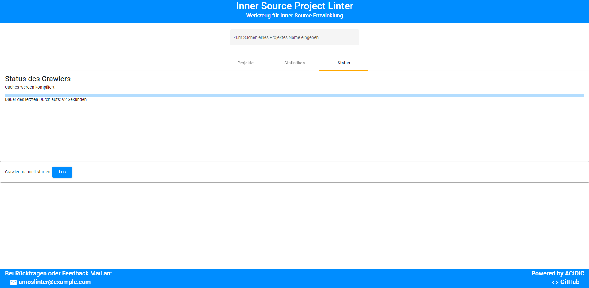

Willkommen bei Inner-Source Project Linter!
Die Applikation ermöglicht es Nutzern, verschiedene Inner Source Repositories anzeigen und vergleichen zu lassen. Somit kann analysiert werden, ob es möglich ist, die Qualität des Projekts zu verbessern.

## Startseite

Auf der Startseite werden alle analysierten Repositories angezeigt. \
(1) Hier ist es möglich, die unten angezeigten Repositories, nach Namen zu Filtern. \
(2) Reitermenü 
- Projekte: zeigt die Projekte und Informationen dazu.
- Statistiken: zeigt Statistiken zu den Projekten und ermöglicht es die Ergebnisse als csv zu exportieren
- Status: zeigt den Status des Crawlers und ermöglicht es ihn manuell zu starten. 

(3) Einstellungen für die Sortierung der unten angezeigten Projekte.\
(4) Änderung der Anzeige wie viele Projekte pro Seite angezeigt werden und wechseln der Seiten. \
(5) Kurze Übersicht zu den Projekten und die möglichkeit sich details zu dem Projekt anzusehen mit dem Anzeigen knopf.

## Ergebnisse ansehen

Wenn man auf den Knopf "Anzeigen" eines bestimmten Repository klickt, öffnet sich ein Dialog auf dem folgende Informationen angezeigt werden: \
(1) Aus-/Einklappbare Reiter für die Tests, sortiert nach der Rubrik. \
(2) Ergebnisse der Spezifischen Tests. \
&emsp;&emsp; Grüne Tests sind bestanden und benötigen keine weitere Arbeit. \
&emsp;&emsp; Gelb, Orange, Rot sind nicht bestandene Tests und sollten bearbeitet werden. Hier wird direkt angezeigt wie der Fehler behoben werden kann. \
(3) Der Info-Button zeigt an, was genau bei dem Test überprüft wird.\
(4) Ein Donut-Graph für eine schnellübersicht wie viele Tests dieses Projekt in der jeweilgen Kategorie bestanden hat.\
(5) Tipps für das Projekt wie man am besten das Repo verbessert.\
(6) Meta Informationen zu dem Projekt.\

## Statistiken ansehen

Im Tab Statistiken kann man zum einem alle Ergebnisse als .csv downloaden, sowie die Entwicklung der Repositories über die Zeit betrachten.

## Crawler Status

Hier wird der Status des Crawlers angezeigt. \
Zum einen wird der aktuelle Arbeitsschritt angezeigt, darunter befindet sich ein Fortschrittsbalken und wie lange der letzte Dirchlauf gebraucht hat. \
Am unteren Ende kann man dann noch den Crawler mit dem "Los"-Button manuell starten. \

